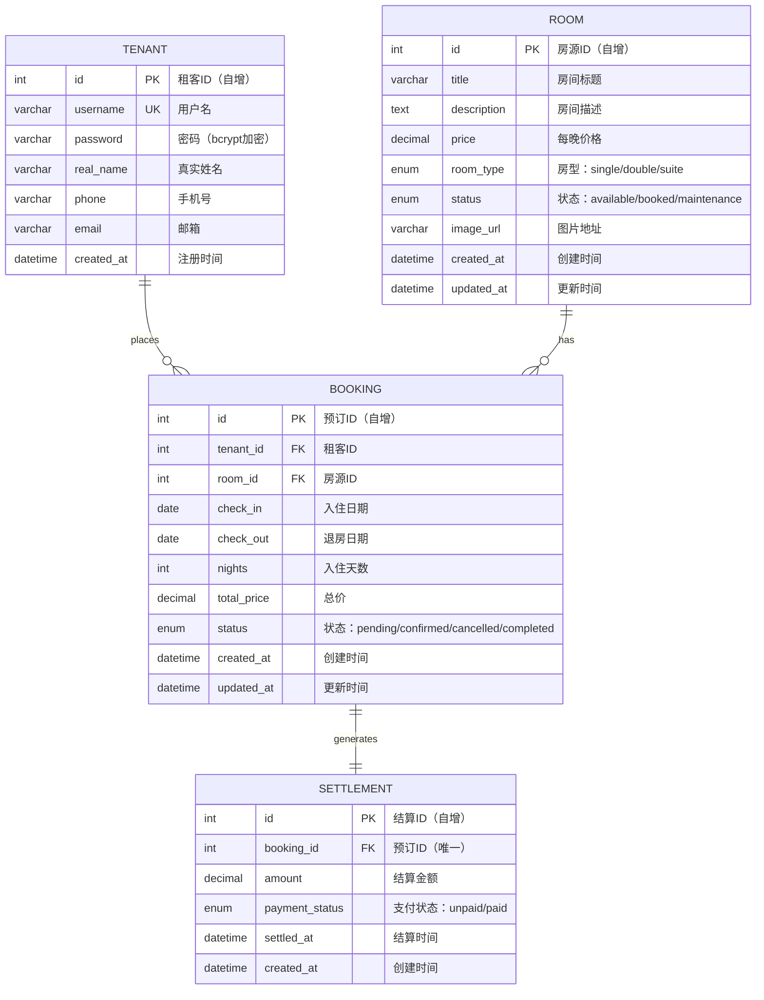
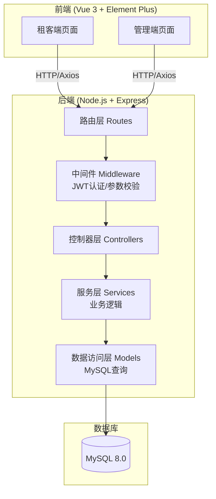

# 系统设计文档

## 日常民宿预订管理系统

| 文档编号 | SD-CBNB-001 |
|---------|------------|
| 版本号   | V1.0 |
| 日期     | 2026-05-23 |

---

## 1. ER 图

---

## 2. 数据库表结构

### 2.1 tenant（租客表）

| 字段 | 类型 | 约束 | 说明 |
|-----|------|------|-----|
| id | INT | PK, AUTO_INCREMENT | 租客ID |
| username | VARCHAR(50) | UNIQUE, NOT NULL | 用户名 |
| password | VARCHAR(255) | NOT NULL | bcrypt加密密码 |
| real_name | VARCHAR(50) | NOT NULL | 真实姓名 |
| phone | VARCHAR(20) | NOT NULL | 手机号 |
| email | VARCHAR(100) | - | 邮箱 |
| created_at | DATETIME | DEFAULT NOW() | 注册时间 |

### 2.2 room（房源表）

| 字段 | 类型 | 约束 | 说明 |
|-----|------|------|-----|
| id | INT | PK, AUTO_INCREMENT | 房源ID |
| title | VARCHAR(100) | NOT NULL | 房间标题 |
| description | TEXT | - | 房间描述 |
| price | DECIMAL(10,2) | NOT NULL | 每晚价格 |
| room_type | ENUM('single','double','suite') | NOT NULL | 房型 |
| status | ENUM('available','booked','maintenance') | DEFAULT 'available' | 房间状态 |
| image_url | VARCHAR(255) | - | 图片地址 |
| created_at | DATETIME | DEFAULT NOW() | 创建时间 |
| updated_at | DATETIME | ON UPDATE NOW() | 更新时间 |

### 2.3 booking（预订表）

| 字段 | 类型 | 约束 | 说明 |
|-----|------|------|-----|
| id | INT | PK, AUTO_INCREMENT | 预订ID |
| tenant_id | INT | FK → tenant.id | 租客ID |
| room_id | INT | FK → room.id | 房源ID |
| check_in | DATE | NOT NULL | 入住日期 |
| check_out | DATE | NOT NULL | 退房日期 |
| nights | INT | NOT NULL | 入住天数 |
| total_price | DECIMAL(10,2) | NOT NULL | 总价 |
| status | ENUM('pending','confirmed','cancelled','completed') | DEFAULT 'pending' | 预订状态 |
| created_at | DATETIME | DEFAULT NOW() | 创建时间 |
| updated_at | DATETIME | ON UPDATE NOW() | 更新时间 |

### 2.4 settlement（结算表）

| 字段 | 类型 | 约束 | 说明 |
|-----|------|------|-----|
| id | INT | PK, AUTO_INCREMENT | 结算ID |
| booking_id | INT | FK → booking.id, UNIQUE | 预订ID |
| amount | DECIMAL(10,2) | NOT NULL | 结算金额 |
| payment_status | ENUM('unpaid','paid') | DEFAULT 'unpaid' | 支付状态 |
| settled_at | DATETIME | - | 结算时间 |
| created_at | DATETIME | DEFAULT NOW() | 创建时间 |

---

## 3. 核心架构图

### 分层说明

| 层级 | 职责 | 示例 |
|-----|------|------|
| Routes | 定义 API 路由和 HTTP 方法 | `POST /api/tenant/register` |
| Middleware | JWT 认证、请求参数校验 | `authMiddleware.js` |
| Controllers | 接收请求、返回响应（不写业务逻辑） | `tenantController.js` |
| Services | 核心业务逻辑、数据校验 | `tenantService.js` |
| Models | 数据库 CRUD 操作 | `tenantModel.js` |

---

## 4. API 接口清单

### 4.1 租客模块

| 方法 | 路径 | 说明 | 认证 |
|-----|------|------|-----|
| POST | /api/tenant/register | 注册 | 否 |
| POST | /api/tenant/login | 登录 | 否 |
| GET | /api/tenant/profile | 获取个人信息 | 是 |
| GET | /api/tenant/bookings | 查看我的预订 | 是 |

### 4.2 房源模块

| 方法 | 路径 | 说明 | 认证 |
|-----|------|------|-----|
| POST | /api/room | 添加房间 | 是(管理员) |
| GET | /api/room | 房间列表 | 否 |
| GET | /api/room/:id | 房间详情 | 否 |
| PUT | /api/room/:id | 更新房间 | 是(管理员) |
| DELETE | /api/room/:id | 删除房间 | 是(管理员) |
| PATCH | /api/room/:id/status | 修改房间状态 | 是(管理员) |

### 4.3 预订模块

| 方法 | 路径 | 说明 | 认证 |
|-----|------|------|-----|
| POST | /api/booking | 提交预订 | 是 |
| GET | /api/booking | 预订列表 | 是 |
| GET | /api/booking/:id | 预订详情 | 是 |
| PATCH | /api/booking/:id/confirm | 确认预订 | 是(管理员) |
| PATCH | /api/booking/:id/cancel | 取消预订 | 是 |

### 4.4 结算模块

| 方法 | 路径 | 说明 | 认证 |
|-----|------|------|-----|
| GET | /api/settlement | 结算列表 | 是(管理员) |
| GET | /api/settlement/stats | 结算统计 | 是(管理员) |
| PATCH | /api/settlement/:id/pay | 标记已支付 | 是(管理员) |
| PATCH | /api/settlement/:id/complete | 订单核销归档 | 是(管理员) |

---

*本文档由结对双方共同编写。*
